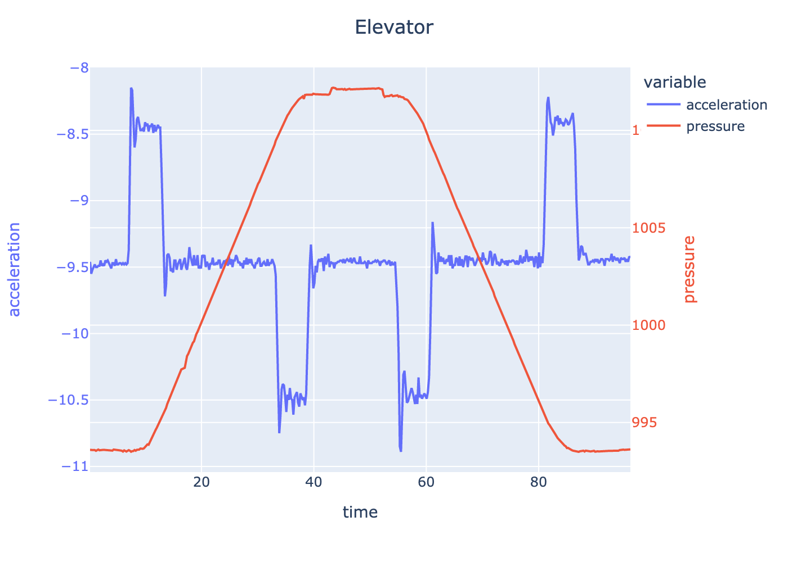

# Sensor stream

This module streams data from some of clue's sensors to a csv file.

## Setup

```bash
# copies the necessary libraries to the clue's lib directory
./setup.sh /path/to/bundle/lib /Volumes/CIRCUITPY

cp code.py /Volumes/CIRCUITPY
```

The clue display should read `Waiting to connect`. Then on the host computer run
main.py:

```bash
python main.py
```

Which should both print out sensor readings to stdout and to a file called `dump.txt`.

## Example - Elevator ride

Using this module you can measure the acceleration and pressure while riding an elevator
in a tall building, which yields the following results!


